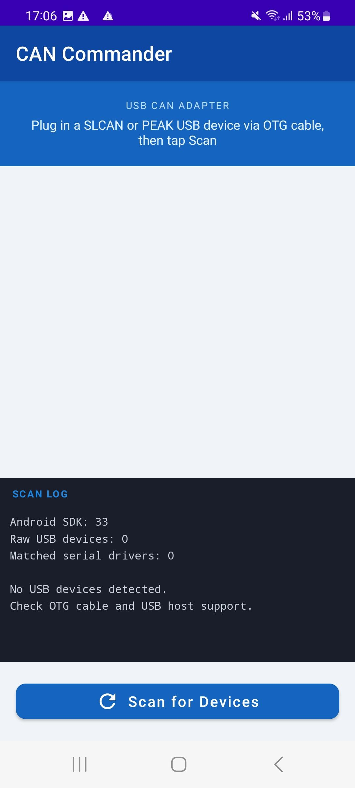
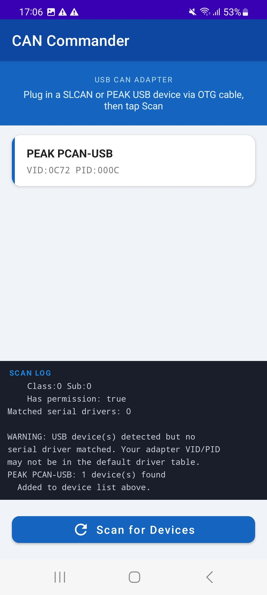
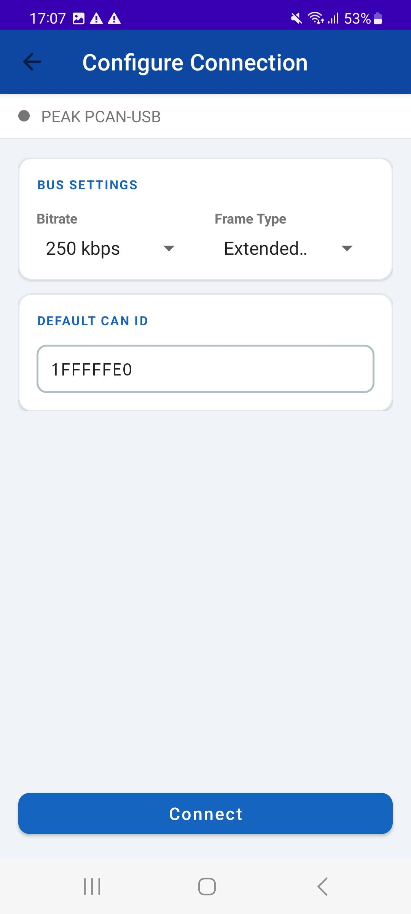
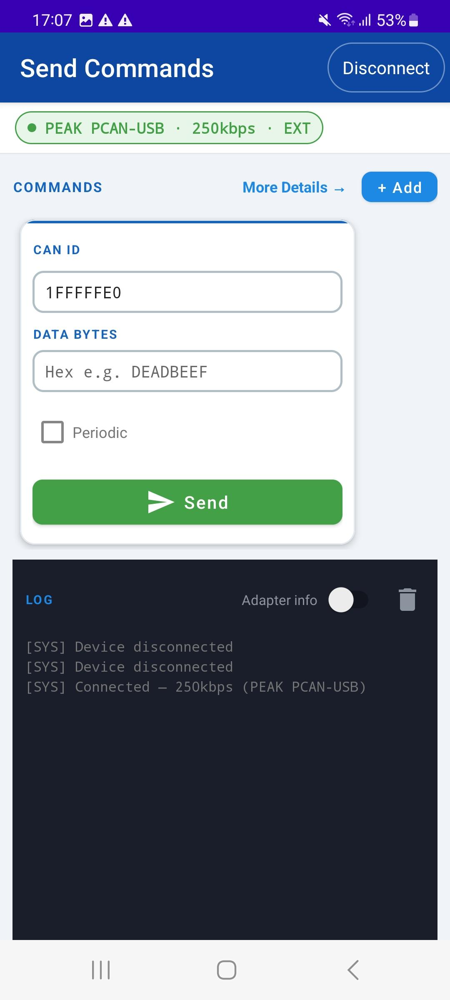
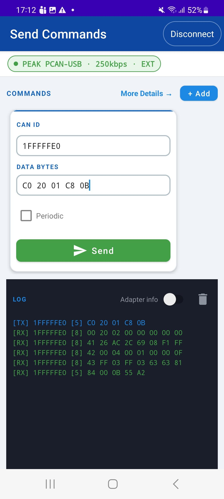
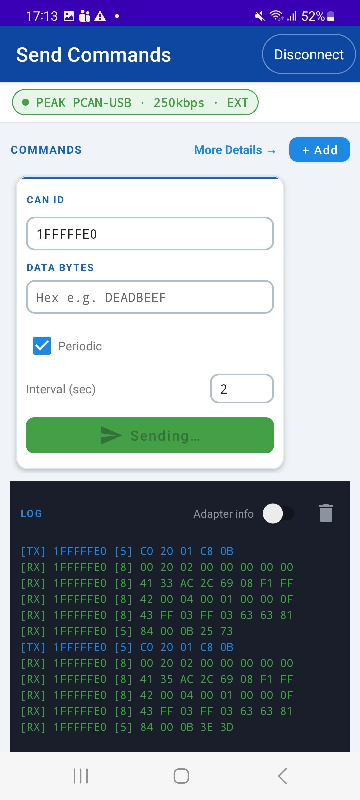
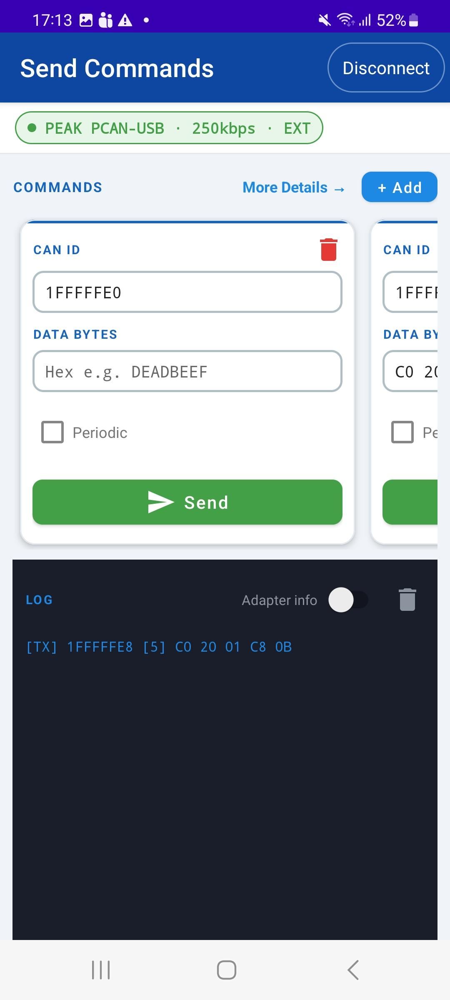
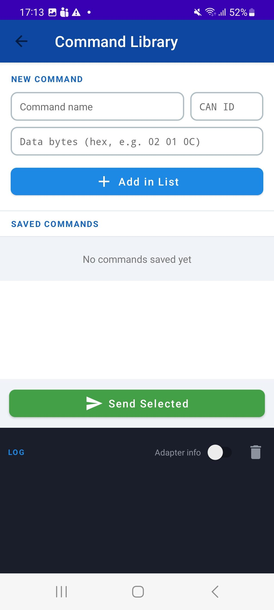
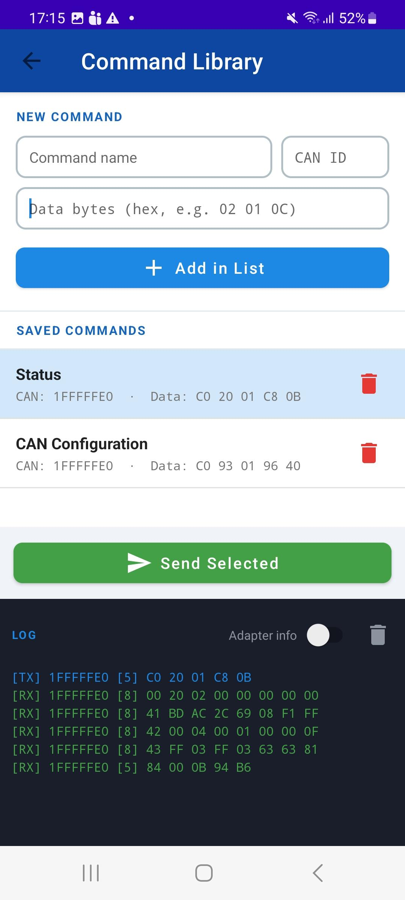
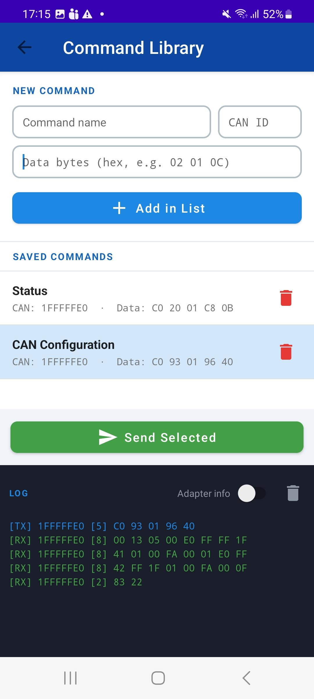

# CAN Commander

An Android application for sending and receiving CAN bus frames over USB using OTG-connected CAN adapters. Supports both SLCAN-compatible serial adapters and the PEAK PCAN-USB device.

---

## Download

[**Download latest APK (debug)**](assets/apk/app-debug.apk)

---

## Demo

[**Watch demo video**](assets/video/App_demo.mp4)

---

## Features

- **Device discovery** — automatically detects SLCAN and PEAK PCAN-USB adapters on USB attach
- **Configurable bus** — bitrate (10 k–1 Mbps), frame type (Standard 11-bit / Extended 29-bit)
- **Multi-card command strip** — send multiple CAN frames independently, each with optional periodic repeat
- **Command Library** — save, name, and reuse CAN frames across sessions (persisted to SharedPreferences)
- **Live log** — colour-coded TX / RX / ERR / INIT output with optional verbose adapter diagnostics

---

## Screenshots

### Device Discovery

| No device connected | PEAK PCAN-USB detected |
|---|---|
|  |  |

### Configure Connection

| Bitrate & frame type selection |
|---|
|  |

### Send Commands

| Connected — ready to send | Live TX / RX log | Periodic mode (auto-repeat) | Multi-card strip |
|---|---|---|---|
|  |  |  |  |

### Command Library

| Empty library | Saved commands | Sending from library — Status | Sending from library — CAN Config |
|---|---|---|---|
|  |  |  |  |

---

## Hardware Compatibility

| Adapter | Protocol | Notes |
|---------|----------|-------|
| CANable / Canable Pro | SLCAN ASCII over USB CDC | Any adapter with a matching usb-serial-for-android VID/PID |
| PEAK PCAN-USB | PEAK proprietary binary | VID `0x0C72` / PID `0x000C` |

> **OTG cable required.** Your Android device must support USB Host mode.

---

## Architecture

The app follows **MVVM** with a clean modular package structure.

```
com.app.canconnection/
├── CanApplication.kt               ← Application; owns app-scoped ViewModelStore
│
├── data/
│   ├── model/
│   │   ├── CanDevice.kt            ← Sealed: SlcanDevice | PeakDevice
│   │   └── SavedCommand.kt         ← Data class for a saved CAN frame
│   └── repository/
│       └── CommandRepository.kt    ← SharedPreferences + JSON persistence
│
├── hardware/
│   ├── CanFrameBuilder.kt          ← SLCAN ASCII command builder (stateless)
│   ├── UsbConnectionManager.kt     ← USB serial driver (SLCAN adapters)
│   └── PeakCanConnectionManager.kt ← USB bulk-transfer driver (PEAK PCAN-USB)
│
├── viewmodel/
│   └── SharedCanViewModel.kt       ← App-scoped ViewModel; owns all CAN state
│
└── ui/
    ├── devicelist/
    │   ├── DeviceListActivity.kt   ← Screen 1: scan & select adapter
    │   └── DeviceAdapter.kt        ← RecyclerView adapter for device list
    ├── configure/
    │   └── ConfigureActivity.kt    ← Screen 2: set bitrate, frame type, CAN ID
    ├── command/
    │   ├── CommandActivity.kt      ← Screen 3: send commands, view live log
    │   └── CommandAdapter.kt       ← Horizontal card adapter with periodic TX
    └── library/
        ├── SavedCommandsActivity.kt ← Screen 4: manage saved commands
        └── SavedCommandsAdapter.kt  ← List adapter with selection + delete
```

### Data flow

```
USB Hardware
     │  bulk/serial bytes
     ▼
UsbConnectionManager / PeakCanConnectionManager
     │  parsed frame strings / log lines
     ▼
SharedCanViewModel  (LiveData: logMessages, connectionStatus, devices, savedCommands)
     │  observe()
     ▼
Activities / Adapters  →  UI
```

---

## Screen Flow

```
DeviceListActivity
       │  tap device
       ▼
ConfigureActivity
       │  Connect (success)
       ▼
CommandActivity  ──────────────────────────→  SavedCommandsActivity
       │  Disconnect                                  │  ← back
       ▼                                              │
DeviceListActivity  ◄─────────────────────────────────┘
```

---

## Project Setup

### Requirements

- Android Studio Hedgehog or later
- Android device with USB Host (OTG) support, API 28+
- Kotlin 1.9+

### Build

```bash
# Clone
git clone https://github.com/Ahmadhussain0335/Android-CANBus-OTG-Debugger

# Open in Android Studio and sync Gradle, or build from CLI:
./gradlew assembleDebug
```

### Key dependencies (`app/build.gradle.kts`)

| Dependency | Purpose |
|-----------|---------|
| `androidx.appcompat:appcompat` | AppCompat Activity / toolbar |
| `com.google.android.material:material` | Material Design components |
| `androidx.recyclerview:recyclerview` | Command and device lists |
| `androidx.lifecycle:lifecycle-viewmodel-ktx` | AndroidViewModel + LiveData |
| `androidx.constraintlayout:constraintlayout` | Device card layout |
| `com.github.mik3y:usb-serial-for-android` | SLCAN adapter USB serial driver |

---

## Protocol Details

### SLCAN (Serial Line CAN)

All commands are CR-terminated ASCII strings sent over a 115200 8N1 serial port:

| Command | Description |
|---------|-------------|
| `S<n>\r` | Set bitrate (S0 = 10 k … S8 = 1 Mbps) |
| `O\r` | Open channel (begin RX) |
| `C\r` | Close channel |
| `t<id3><dlc><data>\r` | Transmit standard 11-bit frame |
| `T<id8><dlc><data>\r` | Transmit extended 29-bit frame |

### PEAK PCAN-USB (Proprietary Protocol)

Based on the Linux kernel driver `drivers/net/can/usb/peak_usb/pcanusb.c`.

| Endpoint | Direction | Purpose |
|----------|-----------|---------|
| `0x01` | OUT | 16-byte control commands (bitrate, bus on/off) |
| `0x02` | OUT | 64-byte CAN TX frames |
| `0x82` | IN | 64-byte RX packets (one or more frame records) |

Each RX packet record starts with an **SL byte**:

| Bits | Meaning |
|------|---------|
| 3–0 | DLC (data length, 0–8) |
| 4 | RTR flag |
| 5 | Extended (29-bit) ID flag |
| 6 | Internal (status) record flag |
| 7 | Timestamp present flag |

> **Note:** The PCAN-USB device always appends a 2-byte timestamp after the CAN ID in every RX record regardless of the TIMESTAMP bit. The parser skips these bytes unconditionally.

---

## Log Colour Coding

| Prefix | Colour | Meaning |
|--------|--------|---------|
| `[TX]` / `[→TX]` | Blue | Frame transmitted |
| `[RX]` / `[←RX]` | Green | Frame received |
| `[ERR]` | Red | Error (validation, connection, protocol) |
| `[INIT]` / `[→CMD]` | Blue | Initialisation / control command |
| `[PEAK STATUS]` / `[SYS]` | Grey | Device status or system event |

Verbose PEAK adapter messages (`[→TX]`, `[←RX]`, `[→CMD]`, `[INIT]`, `[PEAK STATUS]`) are hidden by default and can be enabled with the **Adapter info** toggle on the command and library screens.

---

## License

MIT — see `LICENSE` for details.
